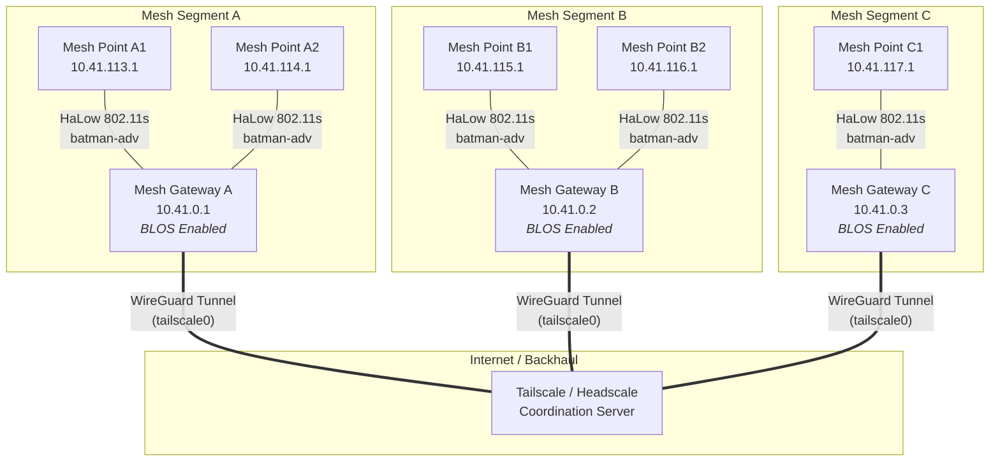
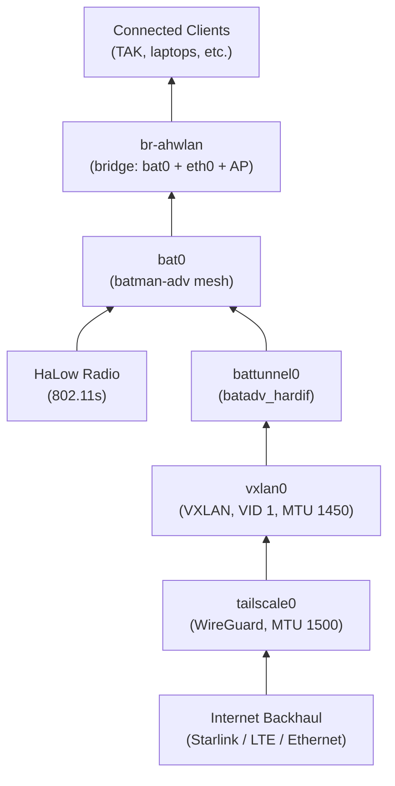
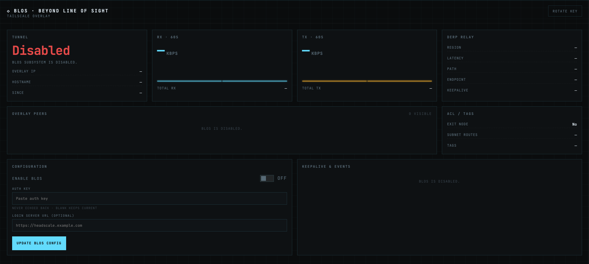

# BLOS (Beyond Line of Sight)

BLOS lets you bridge two or more geographically separated OpenMANET mesh segments into a **single flat broadcast domain** over any internet connection—Starlink, LTE, hotel Wi-Fi, or a wired uplink. Under the hood it layers a **WireGuard tunnel** (via [Tailscale](https://tailscale.com) or self-hosted [Headscale](https://github.com/juanfont/headscale)), a **VXLAN overlay**, and **Batman-adv** so that every mesh point across every segment sees one unified `10.41.0.0/16` network, exactly as if they were all within radio range.

BLOS only runs on **mesh gateway** nodes (nodes that are configured in gateway mode within batman-adv). Each gateway that has an internet backhaul and BLOS enabled becomes a bridge point for its local mesh segment.

---

## Architecture



All three mesh segments behave as a single Layer 2 domain. A device connected to Mesh Point A1 can reach a device on Mesh Point C1 as if they were on the same local network.

---

## How It Works

BLOS builds a four-layer network stack on each gateway node:

### 1. WireGuard Tunnel (Tailscale) — `tailscale0`

**Tailscale (or Headscale) provides an authenticated, encrypted WireGuard mesh between every BLOS-enabled gateway.** Each gateway registers with the coordination server using an auth key. The `tailscale0` interface is created in the UCI network configuration with `proto none` and added to the `ahwlan` firewall zone. The MTU is set to **1500** to allow room for VXLAN encapsulation overhead.

Tailscale preferences are configured automatically:
- **RouteAll** — enabled, so Tailscale forwards all traffic
- **NoSNAT** — disabled, preserving original source addresses across the tunnel
- **AdvertiseRoutes** — advertises `10.41.0.0/16` so the entire mesh address space is reachable across the tunnel

### 2. VXLAN Overlay — `vxlan0`

**A VXLAN (Virtual Extensible LAN) interface provides the Layer 2 bridge over the Layer 3 Tailscale tunnel.** It is configured with:

| Setting    | Value        | Purpose                                             |
|------------|--------------|-----------------------------------------------------|
| `proto`    | `vxlan`      | VXLAN protocol                                      |
| `tunlink`  | `tailscale0` | Rides on top of the Tailscale tunnel                |
| `vid`      | `1`          | VXLAN Network Identifier                            |
| `learning` | `1`          | Enables MAC address learning                        |
| `proxy`    | `1`          | Enables ARP proxying to reduce broadcast traffic    |
| `mtu`      | `1450`       | Accounts for ~50 bytes of VXLAN encapsulation overhead |

### 3. Batman-adv Hard Interface — `battunnel0`

**The VXLAN interface is presented to batman-adv as a hard interface**, just like a physical HaLow radio link. It is configured as:

```
proto:   batadv_hardif
device:  vxlan0
master:  bat0
```

Because batman-adv treats `battunnel0` identically to any other mesh link, routing metrics, originator tables, and gateway selection all work transparently across the BLOS tunnel. The remote mesh segment's nodes appear as regular batman-adv originators.

### 4. Multicast Group Forwarding

**BLOS bridges the layer 2 broadcast domain** so that batman-adv forwards multicast traffic across the VXLAN link to remote segments. All multicast traffic will forward across the BLOS links:

VXLAN peers are also created for each multicast address so that multicast traffic can be delivered across the tunnel without requiring a multicast-capable underlay.

### 5. Automatic Peer Synchronization

**A background status worker polls Tailscale for peer changes every 30 seconds**. On each poll it:

1. Fetches the current Tailscale peer list
2. Compares it against the last known peer set
3. **Adds** VXLAN peers for any new Tailscale peers
4. **Removes** VXLAN peers for any Tailscale peers that have disappeared
5. Refreshes the `vxlan0` interface to apply changes

This means BLOS is fully dynamic—when a new gateway comes online and joins the Tailscale network, it is automatically discovered and bridged into the mesh. When a gateway goes offline, its stale VXLAN peer entry is cleaned up.

---

## Network Stack Diagram

The following diagram shows how the interfaces are layered on a single BLOS gateway:



---

## Prerequisites

Before enabling BLOS, ensure:

1. **Gateway mode** — The node must be configured as a mesh gateway in batman-adv. BLOS will not initialize on standard mesh points.
2. **Internet connectivity** — The gateway needs a working internet uplink (Starlink, LTE modem, Ethernet WAN, etc.) so it can reach the Tailscale/Headscale coordination server and peer gateways.
3. **Tailscale or Headscale account** — You need an auth key from either [Tailscale](https://tailscale.com) (cloud-hosted) or a self-hosted [Headscale](https://github.com/juanfont/headscale) server.
4. **Supported hardware** — The hardware board must support the BLOS feature. Check your board's documentation.

---

## Configuration

### Web UI (Recommended)
1. Navigate to http://{node ip}:8080 and log in with the same credentials as the OpenWRT interface
2. Goto the BLOS page on the left hand sidebar
3. Paste your pre-auth key from Tailscale or Headscale
4. If using Headscale, enter your login server address
5. Toggle the off button to on.
6. Click the Update BLOS config button



Your node will reboot the first time you enable BLOS to clear out any potential route issues.  This is only needed the first time you enable it.

OpenMANETd will automatically manage routes between your peers to bridge the mesh networks together.

### Static Configuration (config.yml)
If you want to setup BLOS manually you first need to enable and start the tailscale service in the LuCI web ui.

Then in the terminal you will want to configure tailscale with a pre-auth key.  The command will look like this:
```
tailscale up --login-server={login server address} --authkey {auth key}
```
**NOTE**: You only need to use `--login-server=` if you are using headscale.

BLOS is configured in the `openmanetd` configuration file at `/etc/openmanetd/config.yml`:

```yaml
blos:
  # Enable or disable BLOS (default: false)
  enable: false
```

| Key                          | Type    | Default | Description                                      |
|------------------------------|---------|---------|--------------------------------------------------|
| `blos.enable`                | boolean | `false` | Enable the BLOS subsystem                        |

{: .important }
Setting `blos.enable: true` in the config file requires that Tailscale is already authenticated and running on the node. For first-time setup, use the API instead (see below), which handles authentication in a single step.

### Runtime Configuration (API)

BLOS can also be enabled and disabled at runtime through the gRPC/REST API without editing the config file. This is the recommended approach for first-time setup because it handles Tailscale authentication and BLOS initialization in one call.

#### GetBLOSStatus

Returns the current state of the BLOS subsystem.

- **Request**: Empty
- **Response**:

| Field          | Type   | Description                                    |
|----------------|--------|------------------------------------------------|
| `blos_enabled` | bool   | Whether BLOS is currently running              |
| `message`      | string | Optional status message with additional detail |

#### UpdateBLOSConfig

Enables or disables BLOS. When enabling for the first time, this endpoint authenticates with Tailscale, configures all interfaces, and starts the BLOS module.

- **Request**:

| Field              | Type   | Required | Description                                                        |
|--------------------|--------|----------|--------------------------------------------------------------------|
| `enable_blos`      | bool   | Yes      | Whether to enable or disable BLOS                                  |
| `auth_key`         | string | Yes      | Tailscale or Headscale auth key                                    |
| `login_server_url` | string | No       | Custom login server URL (for Headscale). Omit to use Tailscale default. |

- **Response**:

| Field     | Type   | Description                              |
|-----------|--------|------------------------------------------|
| `success` | bool   | Whether the operation succeeded          |
| `message` | string | Optional message with additional detail  |

---

## First-Time Setup

When BLOS is enabled for the first time (via the API's `UpdateBLOSConfig`), the following sequence occurs:

1. **Tailscale authentication** — `openmanetd` calls Tailscale's local API with your auth key (and optional Headscale control URL). Tailscale authenticates and establishes the WireGuard tunnel.

2. **Tunnel interface creation** — A UCI network section for `tailscale0` is created with `proto none`. The interface is added to the `ahwlan` firewall zone. If `tailscale0` was previously added to the `br-ahwlan` bridge, it is removed to avoid conflicts with VXLAN.

3. **Tailscale preferences** — RouteAll is enabled, NoSNAT is disabled, and `10.41.0.0/16` is advertised as a Tailscale route.

4. **VXLAN interface creation** — A UCI network section for `vxlan0` is created with VXLAN protocol settings, linked to `tailscale0`.

5. **Batman-adv interface creation** — A UCI network section for `battunnel0` is created as a `batadv_hardif` using `vxlan0` as its device and `bat0` as its master.

6. **VXLAN multicast peers** — Peers are created for each multicast group address to enable multicast over the tunnel.

7. **Configuration marked complete** — BLOS is marked as configured in the OpenMANET UCI config to prevent re-running setup on subsequent boots.

8. **System reboot** — The node reboots to cleanly apply all new network settings. This ensures `tailscale0`, `vxlan0`, and `battunnel0` come up in the correct order.

After the reboot, `openmanetd` starts and detects that BLOS is already configured. It then:
- Sets the MTU on `tailscale0` to **1500** and on `vxlan0` to **1450**
- Joins all multicast groups on the mesh interface
- Starts the **status worker**, which begins polling Tailscale for peers and syncing VXLAN peer entries

---

## Troubleshooting

### Tailscale Authentication Errors

| Tailscale State       | Meaning                                                       | Action                                                         |
|-----------------------|---------------------------------------------------------------|----------------------------------------------------------------|
| `Running`             | Tunnel is active and working                                   | No action needed                                               |
| `Starting`            | Tunnel is coming up                                            | Wait a few seconds                                             |
| `Stopped`             | Tailscale daemon is not running                                | Ensure Tailscale is installed and started, then restart `openmanetd` |
| `NeedsLogin`          | Auth key is expired or invalid                                 | Generate a new auth key and call `UpdateBLOSConfig` again      |
| `NeedsMachineAuth`    | Machine authorization required (Headscale admin approval)      | Approve the node in your Headscale admin panel, then restart `openmanetd` |

### "BLOS requires gateway mode"

This error means the node is not configured as a mesh gateway in batman-adv. BLOS only runs on gateway nodes. Configure the node as a gateway first through the initial setup wizard, then enable BLOS.

### MTU / Fragmentation Issues

If you experience poor throughput or packet loss over the BLOS link:

- Verify `tailscale0` MTU is **1500**: `ip link show tailscale0`
- Verify `vxlan0` MTU is **1450**: `ip link show vxlan0`
- If your internet backhaul has a lower-than-standard MTU (e.g., PPPoE at 1492), you may need to reduce both values proportionally to avoid fragmentation

### Peers Not Appearing

If remote mesh segments are not visible:

- Check that all BLOS gateways are on the **same Tailscale/Headscale network**
- Verify Tailscale shows peers: the status worker logs peer count at debug level
- Ensure the remote gateway is in **gateway mode** and has BLOS enabled
- Check firewall rules: `tailscale0` must be in the `ahwlan` zone