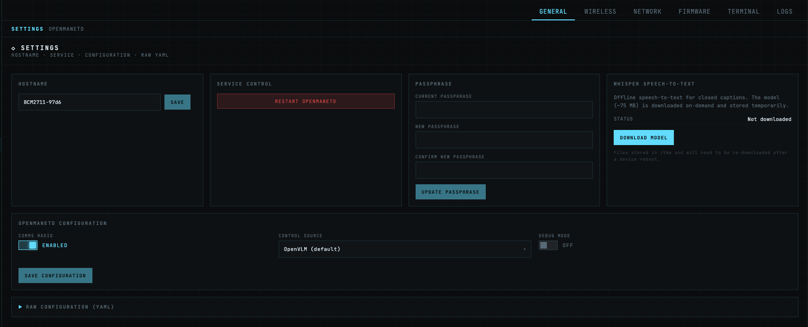

## 1. Prerequisites

Before enabling comms, make sure:

- [`openmanetd`](../openmanetd.md) is installed and running on the node.
- For hardware control sources (`openvlm`, `nanoptt`), the audio device and PTT source are physically attached before you start the daemon. Web mode (`web`) has no hardware requirement.

---

## 2. Choose a control source

Pick the control source that matches how you want to key the mic:

- **`openvlm`** *(default)* — You have an OpenVLM USB HID dongle with a physical PTT button. Hold-to-talk on GPIO3.
- **`web`** — The node has no sound card, or you just want to PTT from the browser.

---

## 3. Minimal working config

### Web UI
- Visit the new web ui at http://<node ip>:8080
- Log in with the same credentials you use on the OpenWRT interface
- Navigate to the settings page
- Toggle the Comms Radio to Enabled




### Config File
Add a `comms:` block to `/etc/openmanet-comms/config.yml`:

```yaml
comms:
  enable: true
  controlSource: openvlm     # openvlm | roip | web | nanoptt
  debug: false             # Debug-level logging while you're bringing the node up
```

A few things to know about where these keys live:

- The mesh interface is **not** under `comms:`. It's the global `meshNetInterface` key (default `br-ahwlan`), read once by the comms manager at startup.
- The multicast talk groups (`McastPorts`) are also **not** under `comms:`. They are loaded from the global talk-groups config, so the same definitions can be reused by other subsystems that need them.
- `openmanetd` hot-reloads the config file when it changes, but toggling `comms.enable` is a full enable/disable cycle — be ready for the log to show the subsystem stopping and restarting.

---

## 4. Multicast talk groups

Comms needs **at least one** multicast talk group configured at the global level before it can start. Each talk group is defined by its multicast address and port; comms will open an RTP sender, an RTCP sender on `port + 1`, and an RTP receiver for each one.

On first startup **only the first talk group** is send/receive-enabled. If you've defined more than one, the rest start dormant. To activate additional groups without restarting the daemon, use the runtime toggles described in step 6.

---

## 5. Per-control-source setup

### `openvlm`

1. Plug the OpenVLM USB HID dongle into the node.
2. Start (or restart) `openmanetd`. On startup, comms walks `/sys` via a CM108 discovery helper to find the dongle and sets `ALSA_CARD` to the matching card index automatically. If the walk doesn't find it, a fallback scans `/proc/asound/card*/usbid` for `0d8c:0012`. If `ALSA_CARD` is already set in the environment, comms leaves it alone.
3. With `debug: true`, the daemon logs the enumerated input devices so you can confirm the dongle was found.
4. Hold the dongle's PTT button to transmit. The button maps to GPIO3 (IR1 bit 2) in the HID report: **press** emits `PTTDown`, **release** emits `PTTUp`. This is hold-to-talk.


### `web`

1. Set `controlSource: web` in the config and make sure `comms.enable: true`.
2. Restart `openmanetd`. In web mode, the malgo audio backend is **never initialized**, so device-open failures cannot stop the daemon from starting — this is the mode to use on any node whose sound card isn't supported or isn't present.
3. Open the OpenMANET web UI on the node, navigate to the comms page, and press the on-screen PTT button. The browser captures mic audio, encodes it with Opus in-browser, and streams it to the daemon over RPC; inbound audio flows back the same way for the browser to decode.
4. No audio hardware, no ALSA config, no HID dongle.

---

## 6. Runtime talk-group toggles

Additional talk groups beyond the first one start dormant. You don't need to restart the daemon to activate them — comms exposes runtime toggles on its `Service` handle:

These are reachable through the openmanetd RPC layer — see [Protobuf API](https://buf.build/openmanet/protobufs/docs/main%3Aopenmanet.comms.v1) for how to issue requests against the daemon.

---

## 7. Verify it's working

With `debug: true` in the comms config, transmit on the node and watch `openmanetd`'s log for the following signals:

- **On PTT press**: `comms: broadcast stream opened` — the capture stream came up.
- **On PTT release**, a per-cycle summary line:

  ```
  comms: broadcast cycle stats captured=1500 encoded=1500 dropped=0
    encode_errors=0 encode_dur_max=8ms encode_dur_avg=4ms frame_budget=20ms
    capture_gap_max=21ms capture_late=0
  ```

  Healthy pipeline: `dropped=0`, `encode_errors=0`, `encode_dur_max` well below `frame_budget` (20 ms), `capture_gap_max` near 20 ms, `capture_late=0`.
- **On the receiving node**: the first packet of a new talker logs `comms: RTP SSRC changed; jitter buffer reset`. That's the expected behavior, not an error.

On the network, a `tcpdump` on the mesh interface during PTT should show RTP packets on the talk group's multicast address and RTCP Sender Reports every 5 seconds on `port + 1`:

```bash
tcpdump -i br-ahwlan -n udp and portrange 38801-38809
```

(Substitute your actual interface name and talk-group port pair.)

---

## 10. Troubleshooting

The per-cycle stats line from step 7 is the primary diagnostic. Use it as the entry point:

| You see | What it means | What to do |
|---|---|---|
| `dropped > 0` | The encode-and-send loop occasionally takes longer than 200 ms cumulative, and the capture queue filled up. | Lower `encoderComplexity` (try 3), or raise `captureLatencyMs`. |
| `encode_dur_max ≈ frame_budget` (20 ms) | libopus encode is starving the audio thread. | Lower `encoderComplexity`. Default is already 5 — try 3 on slow MIPS targets. |
| `capture_late > 0` or `capture_gap_max ≫ 20 ms` | The audio capture callback thread is being preempted by other CPU load. | Raise `captureLatencyMs` (try 80, then 120). Hunt down whatever else is contending for CPU. |
| `encode_errors > 0` | libopus is failing under pressure on this node. | Look at the surfaced error in the Debug log — it tells you exactly why. |
| `dropped=0 encode_errors=0` but remote listeners still hear stutter | The bottleneck is downstream of the encoder — either the kernel's send buffer or the wire itself. | Check `SO_SNDBUF` on the multicast sockets (`net.core.wmem_max` sysctl) and pcap the wire to look for jitter or loss. |

If the daemon refuses to enable comms at all, check the log for a `control source` error — an unknown `controlSource` value fails `Validate()` synchronously on enable, before the background goroutine is spawned, so typos surface immediately.
