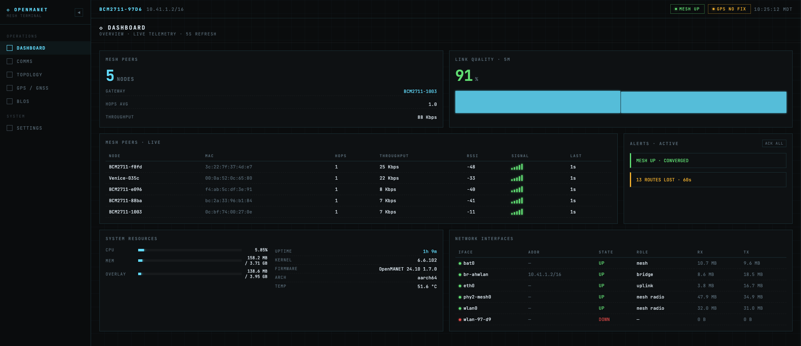
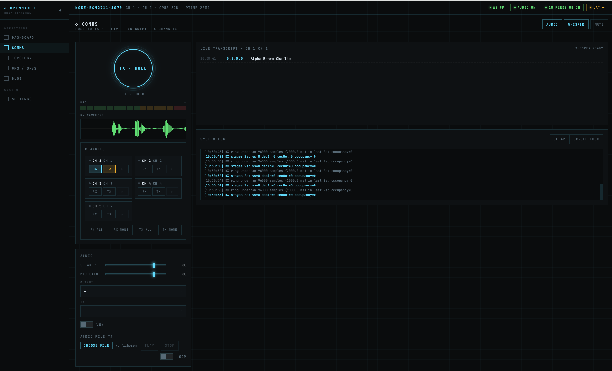
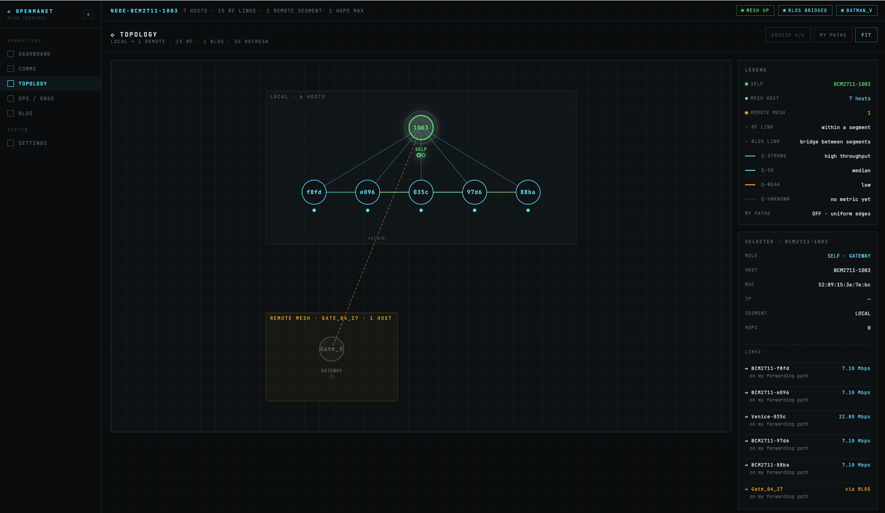
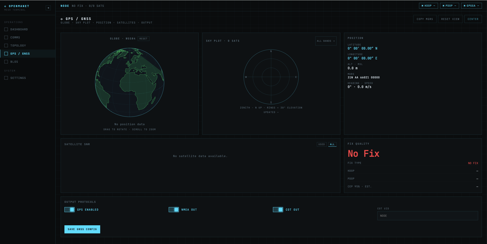
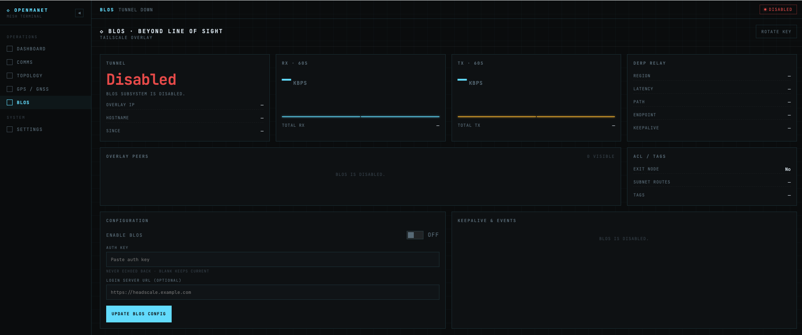
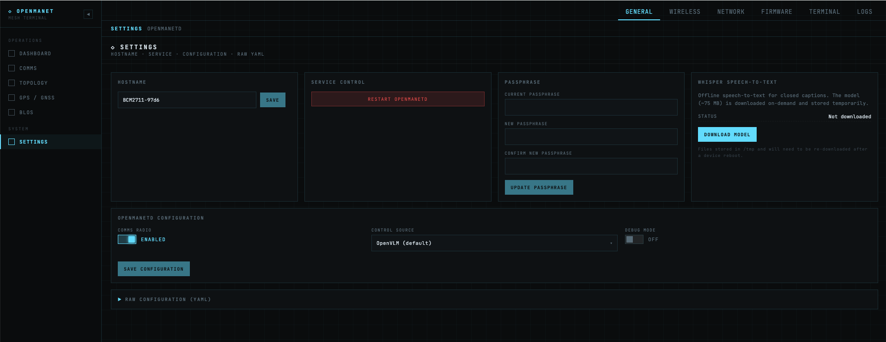
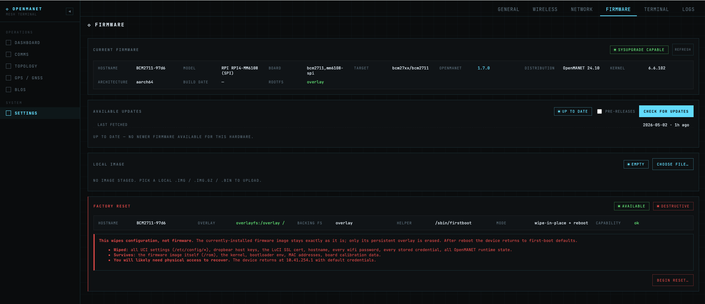

# OpenMANET Web UI (Experimental)

The OpenMANET Web UI is the primary browser-based interface for managing a node and operating it in the field. It's served by `openmanetd` on every node and replaces the need to dig into LuCI or the shell for the vast majority of day-to-day tasks: first-boot provisioning, push-to-talk voice, mesh topology inspection, GPS, BLOS configuration, hostname / wireless / network changes, firmware upgrades, and live log inspection.

The UI is a React single-page app embedded directly in the `openmanetd` binary. It talks to the daemon over [Connect RPC](./openmanetd/protobuf-api.md), so anything the Web UI can do, an external tool can do too — the Web UI just happens to be the most convenient client.

**The new WebUI should be considered experimental**
Over time as we get to feature parity with what we want from the OpenWRT interface, the new UI will become the primary way to configure and manage your OpenMANET node.

---

## Accessing the Web UI

Open a browser on a device connected to the mesh (over Ethernet, Wi-Fi, or another mesh node) and navigate to:

Simple Node Management (HTTP)
```
http://<node-ip>:8080
```

Web Based Comms (HTTPS Required)
```
https://<node-ip>:8081
```

If mDNS is working on your client, the hostname form also works:

```
http://<hostname>.local:8080
```

### Authentication
After setup, the UI is protected by a username/password set during the wizard.

You can change the password later from **Settings → General**.

---

## Layout

The desktop layout is a collapsible left sidebar with the main content area on the right. Sidebar items are grouped into **Operations** (day-to-day) and **System** (administration). On screens narrower than 768 px the sidebar collapses to a bottom tab bar with a "More" overflow sheet.

| Group | Page | Path | Purpose |
|-------|------|------|---------|
| Operations | Dashboard | `/` | At-a-glance health of mesh, GPS, BLOS, power, system, network |
| Operations | Comms | `/comms` | Push-to-talk voice, channels, transcript, mic / waveform |
| Operations | Topology | `/topology` | Full mesh topology graph and per-host inspector |
| Operations | GPS / GNSS | `/gps` | Live fix, sky plot, satellite detail, MGRS |
| Operations | BLOS | `/blos` | Beyond-line-of-sight tunnel status and configuration |
| System | Settings | `/settings/*` | Hostname, comms, wireless, network, firmware, terminal, logs |

A persistent top bar shows the node ID, MESH / GPS / BLOS status chips, and the local-timezone clock so you always know which node you're on and whether its core subsystems are healthy.

---

## Dashboard

The Dashboard is a fixed-grid tactical overview built for an operator who wants the answer to *"is this node OK right now?"* in a single glance.

- **KPI row** — Mesh Peers, Link Quality (5 min sparkline).
- **Mesh Peers Live** — every neighbor the node currently sees, with quality, last-heard age, and stale/lost flagging.
- **Alerts** — auto-classified events: lost peers, GPS dropouts, BLOS state changes, low battery.
- **System Resources** — CPU, memory, uptime.
- **Network Interfaces** — interface roster with link state, IP addresses, and throughput.

PTT latency intentionally lives on the [Comms](#comms) page, and the full topology graph has its own [Topology](#topology) route — the Dashboard deliberately keeps both off so it can stay scannable.



---

## Comms

The Comms page is the operational view for voice on the mesh. It mirrors the [Comms (Push-to-Talk)](./comms) subsystem and gives every browser-connected operator a fully working PTT terminal — even on nodes with no sound card (set `comms.controlSource: web`).

** To use the WebUI you must login to the WebUI with HTTPS on port 8081 and accept the self-signed cert.  This is required to be able to access your microphone in the browser **

Highlights:

- **PTT ring** — large hold-to-talk button driven by the browser's microphone (`getUserMedia`), encoded to Opus in-page via WebCodecs.
- **Mic meter & RX waveform** — real-time visualization of outgoing mic level and incoming audio.
- **Channel grid** — per-channel RX and TX toggles plus bulk "all on / all off" controls. Channels match the talkgroups configured in `openmanetd`.
- **Audio controls** — speaker / mic volume, mute, output device picker, input device picker.
- **Audio file TX** — upload a clip and transmit it on a chosen channel (one-shot or looped).
- **Transcript** — offline speech-to-text powered by whisper.cpp compiled to WASM. The model is fetched once and cached; per-channel silence detection triggers transcription. The model is managed from **Settings → General → Whisper Manager**.
- **VOX** — voice-activated transmit with adjustable threshold and hangtime.
- **System log** — local log of WebSocket events, RPC calls, and audio pipeline state for troubleshooting.

Audio flows over a binary WebSocket from the browser into `openmanetd`'s `WebCommsService`, which feeds the same Opus-over-multicast-RTP pipeline used by hardware PTT clients. A browser is fully interoperable with native nodes on the mesh.



---

## Topology

The Topology page is the dedicated mesh map: an interactive SVG graph of every node batman-adv knows about, augmented with originator overlay data and BLOS gateway flagging.

- **Topology map** — pan / zoom / fit; nodes colored by role (SELF, GATEWAY, MESH NODE, remote-segment node).
- **Legend** — link metric scale (`Mbps` for BATMAN_V, `TQ` for BATMAN_IV).
- **Selected-host inspector** — click a node to see its primary MAC, segment, role, neighbor edges, and per-edge metric / latency.
- **My Paths** — toggle-able overlay highlighting paths from this node to every other host.
- **Topology delta** — short-term churn panel: nodes / edges that appeared or disappeared since the last snapshot.

Polling is aligned with the backend snapshot cadence (5 s) so the panel never shows duplicate frames.



---

## GPS / GNSS

The GPS page surfaces everything `openmanetd`'s GNSS subsystem knows. Useful for fix verification, antenna placement, and time-source confidence.

- **Fix summary** — 2D / 3D / NO FIX, lat/lon (decimal + DMS + MGRS), altitude, speed, heading.
- **Globe** — small canvas globe centered on the current fix, with coastlines and pinch / drag.
- **Sky plot** — azimuth / elevation polar plot of every visible satellite, color-coded by SNR and constellation (GPS, GLONASS, Galileo, BeiDou, QZSS, SBAS).
- **Satellite list** — per-satellite PRN, constellation, SNR, used-in-fix flag.
- **Quality** — DOP (HDOP / VDOP / PDOP), CEP95 estimate, fix rate (Hz).
- **Last update** — age of the most recent fix so you can see if the receiver has gone quiet.

Configuration (enable/disable, NMEA / CoT external sources, etc.) is in `openmanetd`'s config file — see [GNSS / GPS](./gnss).



---

## BLOS

The BLOS page is where you enable, configure, and monitor [Beyond Line of Sight](./blos) tunnels (Tailscale / Headscale + VXLAN + batman-adv) on a gateway node. Non-gateway nodes can view this page but enabling has no effect.

- **Status chip** — running / stopped / starting / needs-login / needs-machine-auth, mirroring the underlying Tailscale state.
- **Enable form** — paste a Tailscale or Headscale pre-auth key, optionally enter a custom login server URL (Headscale), toggle BLOS on, click **Update BLOS config**. The first enable triggers a one-time reboot.
- **Traffic** — RX / TX sparkline graphs and rolling-window throughput.
- **DERP relay** — current DERP region and round-trip time.
- **Overlay peers** — every BLOS-reachable gateway with its Tailscale name, IP, last-handshake age, and link state.
- **ACL tags** — Tailscale ACL tags advertised by this node.
- **Keepalive log** — recent BLOS events streamed from `BLOSService.StreamBLOSEvents` (peer added/lost, online/offline, DERP changed, keepalive).

For the underlying architecture and prerequisites, see the [BLOS page](./blos).



---

## Settings

The Settings area replaces the parts of LuCI most operators actually touch. It's tabbed:

| Tab | Purpose |
|-----|---------|
| **General** | Hostname, comms enable/control source/debug, openmanetd restart, password change, Whisper model manager, raw YAML view |
| **Wireless** | HaLow + 2.4/5 GHz radio settings: SSID, channel, TX power, country code |
| **Network** | LAN/DHCP, gateway-mode WAN, static routes |
| **Firmware** | View current image, upload a new firmware image, schedule reboot |
| **Terminal** | In-browser shell to the node — handy for nodes you can't reach over SSH |
| **Logs** | Live tail of `openmanetd` and system logs with filter / search |

### General tab details

- **Hostname** — changes the system hostname; `<hostname>.local` mDNS follows.
- **Comms Radio** — toggles `comms.enable`. Disabling stops PTT entirely.
- **Control Source** — `web` (browser), `openvlm` (USB HID dongle), `nanoptt` (evdev key input). See [Comms control sources](./comms#control-sources) for details.
- **Debug Mode** — sets `comms.debug` for verbose comms logging.
- **Service Control** — **Restart openmanetd**. Useful after editing config from the shell or when comms / BLOS need a clean reset.
- **Password** — change the Web UI / system password.
- **Whisper Manager** — download / cache / clear the whisper.cpp transcription model used by the Comms page.
- **Raw Configuration (YAML)** — collapsible read-only view of the live `openmanetd` config with form changes pre-merged for preview. Saving deep-merges into `/etc/openmanetd/config.yml`; values not exposed in the form are preserved as-is.





---

## Troubleshooting

**Page won't load at `http://<node-ip>:8080`**
- Confirm you're actually on the `10.41.0.0/16` mesh. If your client has a `192.168.x.x` (or other) address, you're not on the mesh and likely can't reach the node.
- SSH into the node and check `openmanetd` is running. The Web UI is served by the daemon; if it's down, the UI is down.

**Login page rejects credentials**
- Use the password set in the wizard. There's no out-of-the-box default. If lost, recovery requires SSH access to reset auth state on the node.

**Comms page shows "WebSocket disconnected"**
- The browser couldn't open the audio WebSocket. Usually means `openmanetd` isn't running, or there's a reverse proxy stripping the WebSocket upgrade headers.

**No audio on TX or RX**
- To use Web UI Comms you must access the interface on port 8081 (HTTPS)
- Confirm `comms.enable: true` in **Settings → General**.
- For browser-only nodes, set Control Source to **Web UI** so `openmanetd` doesn't try to grab a non-existent sound card.
- Check the browser actually has microphone permission.

**Topology page is empty**
- The node has to be on a working mesh and `batadv-vis` has to be producing snapshots. Verify on the Dashboard that you have at least one mesh peer.

**BLOS page shows "BLOS requires gateway mode"**
- BLOS only runs on batman-adv gateway nodes. Reconfigure the node as a gateway via the Setup Wizard or `openmanetd` config and reboot.

---

## See also

- [Initial Setup](./initial-setup) — first-boot provisioning walkthrough that uses the Setup Wizard.
- [Comms (Push-to-Talk)](./comms) — the PTT subsystem behind the Comms page.
- [BLOS](./blos) — architecture and prerequisites for the BLOS page.
- [GNSS / GPS](./gnss) — GPS subsystem the GPS page visualizes.
- [OpenMANETd Daemon](./openmanetd) — the daemon that hosts the Web UI and serves it over Connect RPC.
- [Networking](./networking) — mesh addressing, so you know which IP to hit from your client.
